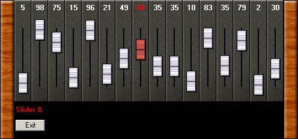



## Simple and Smooth Slider programming

### Description

This Vb code shows how easy and good looking sliders can be. This code can be used to enhance your programming for audio, midi and sound programming. Find out in the code how simple some routines are done and freely use it for further purpose in your application. Voting will help giving more of my code out. Do not forget to download the free Live Midi Keyboard from www.rempro.nl
 
### More Info
 
Happiness

             |
---                |---
**Submitted On**   |2003-07-28 18:32:02
**By**             |[Remco de Hundt](https://github.com/Planet-Source-Code/PSCIndex/blob/master/ByAuthor/remco-de-hundt.md)
**Level**          |Advanced
**User Rating**    |5.0 (15 globes from 3 users)
**Compatibility**  |VB 5\.0, VB 6\.0
**Category**       |[Miscellaneous](https://github.com/Planet-Source-Code/PSCIndex/blob/master/ByCategory/miscellaneous__1-1.md)
**World**          |[Visual Basic](https://github.com/Planet-Source-Code/PSCIndex/blob/master/ByWorld/visual-basic.md)
**Archive File**   |[Simple\_and1621037282003\.zip](https://github.com/Planet-Source-Code/remco-de-hundt-simple-and-smooth-slider-programming__1-47226/archive/master.zip)

